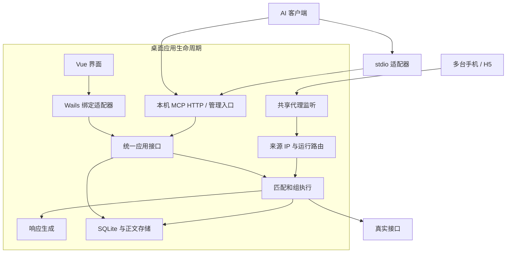
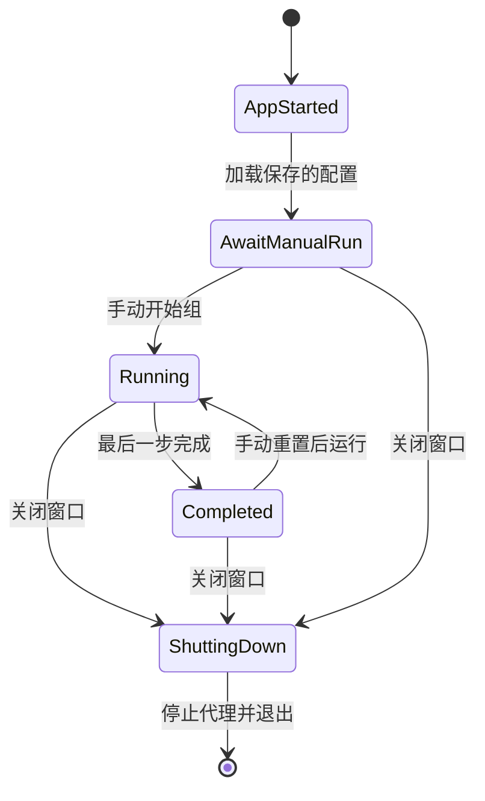

# MockCharles 架构设计

日期：2026-09-09。状态：已确认技术栈下的详细设计草案；产品细则仍按主设计稿登记，尚未实现代码。

产品按 [四模块项目规划](project-plan.md) 组织：设备管理、规则管理、规则集管理、流量；四个用户模块不限制后端技术模块数量。详细模块设计见 [设计系列索引](design/README.md)，剩余问题统一见 [决策登记](design/decisions.md)。

需求依据：[功能设计](design-draft.md)。外部技术依据：[桌面选型](research/desktop-stack.md)、[AI 接入](research/ai-integration.md)。本文的字段、模块和操作名称是本项目设计，不是框架或 MCP 标准强制定义。

## 1. 确定的架构约束

- Wails v2 + Go + Vue 3/TypeScript + SQLite，Windows/macOS 桌面。
- 应用关闭窗口即退出并停止代理；重启后必须手动开始组运行。
- 多设备共用代理端口；实际来源 IP 决定设备和独立组运行。
- 每 IP 可选择真实转发、独立 Mock、顺序 Mock 组三种工作模式。
- 新 IP 默认真实转发，用户手动绑定项目和配置；未绑定来源的通用 Header 作用域待 D20。
- 固定响应和每次请求随机响应并存；业务记录只在编辑时作为来源。
- 组当前步骤未命中、组完成后的请求都转发真实服务，通用 Header 仍生效。
- 团队共享后期实现；本期不引入中心服务器或独立常驻守护进程。
- 按原始请求的方法、域名、路径，可附加 Query/Header/JSON Body 条件匹配。
- 通用 Header 先应用，命中接口的规则覆盖同名字段。
- 生成失败返回明确 Mock 错误，步骤不推进，修正后重试。
- 响应内容与随机规则保存后对下一次请求生效，不重置当前步骤；组步骤顺序修改在手动重置后生效。
- 保存抓包、启用独立 Mock、启用组步骤是独立开关；禁用组步骤在下次开始/重置时跳过。
- 切出顺序组模式或改绑另一个组时停止旧运行；切回/新组手动开始，不自动续跑。
- 独立 Mock 按界面可调整的规则顺序取第一条启用且匹配的规则，显示命中原因。
- 首版 AI 只管理 Mock 数据与规则，不允许切换设备模式、绑定组或开始/停止/重置运行；运行控制由桌面界面执行，后续再考虑 AI 扩展。

## 2. 进程与模块

图内表示同一应用生命周期及后台业务模块，不意味着系统 WebView 与宿主必然是同一操作系统进程。WebView 进程管理由框架和操作系统负责。

Go 核心不依赖 Wails 窗口对象；只有桌面适配层导入桌面框架。这使后期可复用相同核心增加团队服务入口，而不把窗口事件写进规则和数据逻辑。

stdio 客户端启动的小适配器只连接已运行的本机应用，不能独立打开数据库、占用手机代理端口或启动另一套场景运行。应用关闭后返回 APP_UNAVAILABLE；客户端是否保持适配器进程由其宿主管理。

## 3. 生命周期

### 已确认行为

每台设备有自己的运行状态；图中的 Running/Completed 不代表所有设备共享进度。应用启动时不自动续跑旧组。

### 退出处理建议

1. 进入停止阶段，拒绝新的管理写操作和新代理连接。
2. 通知正在处理的请求取消或在有限时间内完成，具体排空策略待确认。
3. 结束未完成的组运行并记录原因，不将其标记为业务成功。
4. 保存已提交配置、结束记录写入、关闭监听和数据库。
5. 退出桌面宿主。

如果产品以后支持修改电脑系统代理，只恢复本应用实际改过、且尚未被外部改变的设置；不会声称退出时自动修改手机的 Wi-Fi 代理。手机代理需要用户自行调整，或重新打开本工具。

已确认启动后不自动监听，需手动开启。仍待确认：是否保留上次 IP 到组的选择、在途请求排空上限、未保存编辑提示。关闭后后台持续代理已经明确不需要。

## 4. 数据与状态归属

| 数据 | 拥有者 | 更新方式 |
| --- | --- | --- |
| 样本和业务记录 | 数据编辑模块 | UI/AI CRUD |
| 响应模板及固定内容 | Mock 配置模块 | 编辑保存成版本 |
| 随机字段规则 | Mock 配置模块 | 校验后形成版本 |
| 组顺序和步骤引用 | 组配置模块 | 保存组版本 |
| 设备 IP、工作模式与组选择 | 设备管理模块 | 用户选择真实转发/独立 Mock/顺序组，按需绑定组 |
| 当前步骤与执行状态 | 组运行模块 | 请求命中、重置、停止 |
| 实际收发正文 | 流量记录模块 | 按记录策略保存 |
| CA 私钥与签发缓存 | 证书模块 | 本机生命周期管理 |

动态随机执行只使用响应版本中的模板和生成规则。它不通过 datasetId 在请求时读取业务记录。

已确认：启动/重置时确定本次组的步骤顺序，后续顺序编辑不改变正在运行的顺序；手动重置采用新顺序。步骤引用稳定的 Mock 对象，命中时选定其当前已保存响应版本，因此响应内容或随机规则修改后下一次请求生效，不重置游标。

每条请求一旦选定响应版本，就使用该版本直到本次处理结束；编辑期间的在途请求不混用新旧配置。若请求与保存同时发生，按响应版本读取与保存提交的先后决定，日志记录实际使用的 revision。通用 Header 规则修改及匹配条件修改的生效时机尚未在本次确认范围内，另行明确。

## 5. 核心接口草案

名称表达模块职责，不冻结 Go 包名或具体函数签名。

| 模块 | 对外操作 | 保证和错误 |
| --- | --- | --- |
| RecordCatalog | 查询、读、保存、删除样本/业务记录 | 项目归属、分页、版本冲突；删除源记录不删除已生成响应正文 |
| MockCatalog | 保存/读取响应版本、启停规则、模式切换 | 校验 JSON 与生成规则；无效配置不可成为可执行版本，是否可存草稿待确认 |
| ResponseGenerator | Validate、Generate | 输入保存模板和上下文，输出最终 JSON 与生成标识；不访问源记录库 |
| GroupCatalog | 保存/读取组版本、校验步骤 | 引用完整、步骤顺序有效；开始/重置时只编入启用步骤，运行中不改变有效步骤列表 |
| DeviceRouter | 获取来源 IP、读取/切换工作模式、查询/修改组绑定 | 只信连接实际来源；新 IP 默认真实转发；三种模式均应用通用 Header |
| RunEngine | Start、Handle、Get、Reset、Stop | 每 IP 独立运行；只有当前步骤命中才可能推进 |
| HeaderRewriter | ApplyRequest、ApplyResponse | 保留多值 Header；不自行决定响应来自 Mock 还是上游 |
| TrafficStore | Append、List、ReadBody | 返回实际处理结果；有限缓存及保留策略待确认 |
| ApplicationLifecycle | Start、Shutdown | 统一停止代理、MCP 管理执行和存储 |
| ControlFacade | 组合上述管理操作 | Wails/MCP 共用业务校验和版本规则；按可信调用身份限制操作，AI 运行控制拒绝 |

HTTP 解析和 TLS 由代理库承担。产品层输入已解析请求，输出明确响应决策，便于在无需实际手机的情况下验证规则；这不是本阶段开始编写测试的指令。

### 请求决策的结构

建议内部返回：

- requestId、projectId、sourceIp、runId（无运行时为空）。
- route：固定 Mock、随机 Mock、真实服务。
- matchReason：当前步骤命中、提前步骤、已完成步骤、无绑定、组完成、普通规则命中等。
- responseRevision、groupRevision、stepId。
- 使用的 Header 规则版本。
- 最终响应或上游转发计划，以及生成/转发错误。
- 是否推进，由运行模块控制，不由生成器或 UI 修改。

已确认先按设备工作模式路由：真实转发直接访问上游；独立 Mock 对适用规则按界面顺序依次检查，取第一条启用且匹配的规则，未命中访问上游；顺序组只匹配当前步骤，无运行、未命中或已完成时访问上游，不回退到独立规则。所有路径均应用通用 Header，命中独立规则/组步骤时再叠加接口规则。切出顺序组或改绑另一个组时停止旧运行，切回/新组需要手动开始；在途请求处理仍待确认。

## 6. 一次请求如何执行

1. 接收代理连接，解析实际来源 IP，进行地址规范化。
2. HTTPS 根据配置决定解密或仅隧道转发；不能解密的请求不尝试读 JSON 或应用 HTTP Header 规则。
3. 为可处理 HTTP 请求分配 requestId，读取 IP 对应的工作模式、组绑定及本次配置版本；新 IP 使用真实转发模式。
4. 真实转发模式跳过 Mock 匹配；独立 Mock 模式按配置顺序选取第一条启用且匹配的规则；顺序组模式只判断当前步骤。匹配均使用修改前的原始请求，覆盖已确认的方法、域名、路径和可选字段条件。
5. 应用通用请求 Header；若命中且配置了接口专用规则，在通用规则之后应用，接口规则覆盖同名字段。
6. 命中时读取固定内容，或执行保存的随机规则；未命中时转发真实服务。若生成失败，返回明确 Mock 错误并保留当前步骤，不转发真实服务。
7. 应用通用响应 Header，以及命中接口的响应 Header；修正正文长度、压缩和内容类型。
8. 将响应交给代理内核写出，记录实际生成与交付结果。
9. 仅完整响应写入连接成功后更新步骤；生成或写入失败均不推进，记录错误原因。

已确认在完整响应写入连接成功后推进。生成成功、写入连接成功、客户端收到/消费数据是不同事件，服务端不能保证最后一个事件。网络写出与数据库提交无法成为同一原子事务；并发等待和在途切换细则见详细运行设计。

### 并发约束

- 只对同一个运行的判断和推进做同步，不给所有设备加同一把锁。
- 未命中请求调用真实服务时不占用该设备的步骤状态锁。
- 随机生成、响应校验和推进不能让两个并发请求重复消费同一步。
- 预览调用不改变运行游标或请求随机上下文。
- 重置/改绑与在途命中的竞争使用运行代次或版本识别，旧请求不得推进新运行。
- 已完成步骤的重试按新的当前步骤判断；不命中就真实转发，这是已确认行为。

## 7. SQLite 逻辑模型草案

以下用于审阅关系，不是执行迁移文件。约束、保留策略和索引按最终使用规模调整。

| 表/实体 | 关键字段 | 关系与约束建议 |
| --- | --- | --- |
| projects | id, name, revision | 本期本地项目，后期共享归属 |
| datasets | id, project_id, name, schema_json, revision | 编辑用集合；schema 是否强制待确认 |
| dataset_records | id, dataset_id, data_json, revision | 用户维护的业务记录 |
| response_samples | id, project_id, source_flow_id, content_json, revision | 抓包样本；不依赖原流量永久存在 |
| mock_rules | id, project_id, matcher_json, standalone_enabled, active_response_revision | standalone_enabled 只控制独立 Mock，组步骤不读取此开关；顺序属于规则集成员关系 |
| rule_sets / rule_set_members | set_id, mock_id, position, revision | 每台设备选择一个规则集，多设备可复用；成员顺序整体更新 |
| response_revisions | id, rule_id, mode, status, headers_json, body_or_template_json, generation_spec_json, provenance_json | 保存完整内容或模板，版本不可变的建议 |
| header_rule_sets | id, project_id, scope_json, operations_json, priority, revision | 通用规则与作用范围 |
| capture_policies | id, project_id, matcher_json, persist_enabled | 单独控制抓包记录保存，不参与 Mock 启用判断；优先级及保留范围待细化 |
| mock_groups | id, project_id, name, active_revision | 组身份 |
| group_revisions | id, group_id, revision | 一次组定义快照 |
| group_steps | id, group_revision_id, position, enabled, matcher_json, mock_rule_id | 顺序固定于组版本；通过稳定 Mock ID 在每请求时确定活动响应版本 |
| client_bindings | id, project_id, source_ip, label, mode, selected_group_id, selected_rule_set_id | mode 为 pass_through / standalone_mock / scenario，新 IP 默认 pass_through；只有 scenario 路由使用组运行；同一来源 IP 同时只绑定一个项目，选择须属于该项目（D15 已确认） |
| scenario_runs | id, binding_id, group_revision_id, state, cursor, generation, revision | 每绑定最多一个活动运行 |
| step_executions | id, run_id, step_id, request_id, response_revision_id, outcome, body_ref | 保存本次实际选用的响应版本，不通过活动版本指针反推历史 |
| flow_records | id, source_ip, time, method, host, path, route, run_id, request_ref, response_ref | 支持按 IP/时间/来源筛选 |
| change_records | id, actor, object_type, object_id, before_revision, after_revision, time | 区分 UI/AI 修改来源 |

Header 存储必须支持同名多值形式。provenance 保存来源记录 ID/版本和必要快照，不能使用级联删除让用户删源数据时同时删掉已有 Mock。

保存响应版本、切换规则活动版本、记录变更应在同一事务内；保存组版本和其全部步骤也应整体提交。UI/MCP 更新带 expectedRevision，冲突返回明确错误而不是覆盖。

只有 Go 后台管理数据库连接。针对抓包正文的大量写入，使用有界队列并批量写入的方案待性能设计确认；步骤状态提交不能悄悄复用“可以丢弃”的流量展示队列。

## 8. 随机生成模型

生成配置由 JSON 字段位置、数据类型及约束组成，允许未配置字段保留模板值。

- 列表：固定长度或范围内数量；已确认编辑时选一条记录作为模板，生成新条目并只随机指定字段，其他字段保留模板值。
- 数值：整数/小数范围与精度；上下界及单位要明确。
- 枚举：有限候选值。
- 字符串：候选词或指定长度/格式，具体首版格式待确认。
- 布尔：true/false，概率配置是否提供待确认。
- 嵌套字段：对象与列表项内的规则。
- ID：同一响应内唯一；若可选空间小于所需数量，校验失败，不无限重试。

跨接口业务标识保持固定，首版不做变量提取和跨步骤 ID 传播。随机模式保证每请求执行生成器，不保证每次结果必定不同。

生成标识建议包含响应配置版本、生成器版本、运行上下文和可选 seed；实际响应是调试依据。用户切换固定模式时建议冻结选定预览或已记录结果，具体交互尚未确认。

## 9. Wails、Vue 与 AI 的调用关系

Vue 采用 Composition API、script setup 与 TypeScript。界面负责编辑草稿、筛选条件、选中设备和显示结果；Go 负责已保存配置、规则判定、运行进度和实际响应。

前端按设备管理、规则管理、规则集管理、流量四个功能区组织；数据目录归规则编辑辅助，组编辑归规则集，设置作为公共入口。根组件仅组合页面；运行进度来自后台事件，不能在前端自增来模拟已执行步骤。编辑器草稿与当前运行引用的版本独立展示。

Wails 绑定和 MCP 的数据操作转为相同应用命令，不分别实现 JSON 生成或规则优先级；可访问的操作集合不同。首版运行控制只允许桌面入口调用，MCP 不注册切模式、绑定、开始/停止/重置工具。

共享应用接口按可信适配器身份授权，不能用请求体自报 actor=desktop 获取权限。通用 CRUD、批量和导入接口不得接收或隐式执行 mode、binding、cursor、run.state 等运行控制字段。可编辑响应内容仍按下一请求生效，不因禁止运行控制而改为仅保存草稿。配置删除或启用字段的具体约束待单独明确。

共享核心管理操作如下；其中运行控制供桌面调用，不等同于全部作为 MCP 工具提供：

| 操作 | 关键输入 | 输出 |
| --- | --- | --- |
| mocks.create/update/get/list/delete | projectId, mockId, expectedRevision, 配置 | 对象、版本或冲突 |
| responses.preview | 草稿或已保存版本、可选 seed | JSON 结果、校验问题，不改变运行 |
| records.query/create/update/delete | datasetId, recordId, expectedRevision | 业务记录 |
| groups.save/get/list | groupId, expectedRevision, steps | 组版本与引用校验 |
| bindings.setMode / assign（仅桌面） | sourceIp, mode / groupId, expectedRevision | AI 拒绝；切出组模式或改绑另一个组时停止旧运行；不自动启动新运行；在途处理待确认 |
| mocks.reorder | scopeId, orderedRuleIds, expectedRevision | 修改独立规则先后顺序，校验重复/遗漏；作用范围已确认是设备所选规则集，生效时点待确认 |
| runs.start/reset/stop（仅桌面） | bindingId/runId, expectedGeneration | AI 拒绝；返回运行状态、游标 |
| runs.get | runId | 只读状态，不推进或修改运行 |
| traffic.list/read | sourceIp, cursor, filters | 分页摘要与按需正文 |

这些是语义契约草案，不是最终 REST 路径或 MCP 工具名。MCP 连接会话不是业务 runId；重新连接 AI 客户端不能改变手机当前组进度。AI 数据 CRUD 已在需求内；切换设备模式、绑定和运行启停/重置已确认首版禁止，后续再考虑。

## 10. 验证设计

本阶段不执行实现测试；正式实现按以下风险分层验收：

- 生成模块：固定内容、随机约束、嵌套规则、唯一 ID 不可满足条件、预览不推进。
- 路由模块：每 IP 独立选择三种模式，新 IP 真实转发；通用 Header 始终应用；组未命中/完成时不落入独立 Mock。
- 开关独立性：抓包保存开关不影响 Mock；独立 Mock 开关不影响组步骤；禁用步骤在下次开始/重置时跳过。
- 运行模块：多 IP 独立组、提前/重复请求真实转发、完成后透传、重置与在途竞争；切出组/改绑停止旧运行，切回不自动续跑。
- 独立规则：两条启用规则同时命中时取顺序第一条，禁用第一条后匹配后续规则；不隐式叠加额外具体度排序，记录实际命中原因。
- 适配一致性：Wails 与 MCP 编辑同一对象得到相同行为；错误和版本冲突一致。
- AI 权限：MCP 不暴露运行控制工具；AI 身份直接调用核心或借通用更新/导入修改运行控制字段均拒绝；桌面控制可用，正常数据 CRUD 可用。
- 代理协议：真实手机 HTTPS、压缩正文、多值 Header、上游错误、取消。
- 生命周期：关闭窗口停止监听；旧 MCP 适配器不能继续改数据；重启不自动续跑。
- 数据保存：响应不因源记录删除/修改隐式改变；规则与组版本写入完整。
- 修改生效：当前步骤生成失败后保存修复，重试使用新响应版本而不重置；修改组顺序只在手动重置后生效；保存期间已开始处理的请求保留原响应版本。
- 两平台性能：安装包及运行时依赖、启动、内存、并发流量、随机大列表、UI 正文按需读取。

## 11. 未决细则

首版架构和已确认功能已可以按以上模块划分；以下产品行为仍需咨询后冻结：

- 原始请求完整匹配范围、接口 Header 覆盖通用规则、生成失败报错不推进均已确认；匹配操作符与错误格式还需细化。
- 三种设备模式、独立开关和切出组/改绑停止旧运行已确认；在途请求处理仍待确认；响应修改下一请求生效、组顺序修改重置生效已确认。
- 完整写出成功才推进已确认；启动后不自动监听、需手动开启代理已确认（D07，2026-09-10）；并发候选等待、退出排空仍待确认。
- 单记录模板合成已确认；固定/随机切换交互仍待确认。
- 记录保留/容量、目标系统/架构与性能量级；AI 运行控制已确认首版不开放。

尚未选定代理库发布版本、SQLite 驱动和 UI 编辑器依赖；这些技术依赖先做对应协议与平台验证，再记录确定版本，不用未测试的选择替代验收。
