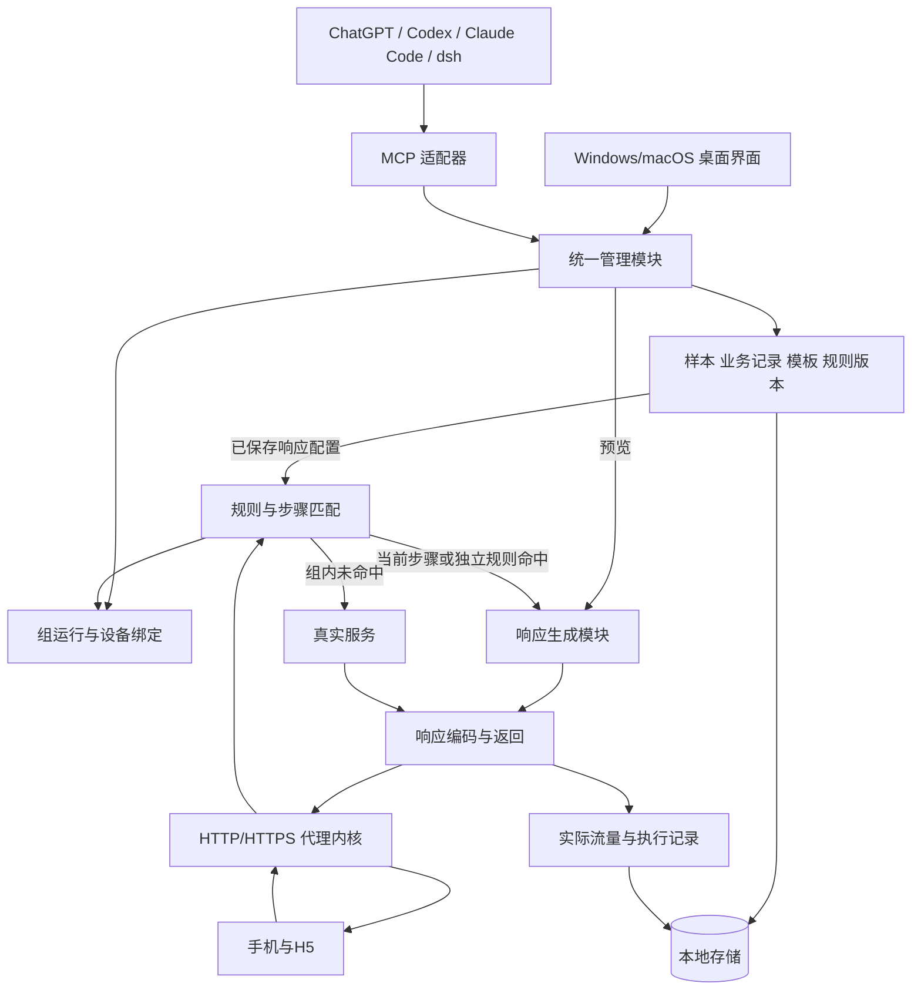

# MockCharles 功能与架构讨论稿

日期：2026-09-09。状态：需求确认中；尚未进入代码实现。

产品结构以 [四模块项目规划](project-plan.md) 为准；本文保留原有能力细节。本文记录已确认需求、架构建议与待确认项。已确认内容不重复询问；未回答的事项不视为同意。初始工作区为空，无既有技术栈约束。

逐项开发入口见 [四模块功能分析](functional-analysis.md)：功能编号、输入输出、异常及验收映射在该文件维护；本稿保留能力背景和原确认。

## 1. 已确认的范围

| 事项 | 当前决定 |
| --- | --- |
| 产品形态 | Windows/macOS 桌面应用 |
| 使用与演进 | 首先本地使用，团队共享后期实现，当前预留架构 |
| 接入对象 | 自研 Android/iOS App 与 H5 |
| 协议范围 | HTTP/HTTPS JSON 接口 |
| 流量功能 | 请求/响应展示、接口内容 Mock |
| Header | 请求和响应 Header 都支持修改；先通用规则，接口规则覆盖同名字段 |
| 接口匹配 | 按原始请求的方法、域名、路径匹配，可追加 Query、Header、JSON Body 字段条件 |
| Mock 生成失败 | 返回明确 Mock 错误，不推进当前步骤，修正后重试 |
| 修改生效 | 响应内容/随机规则保存后下一次请求生效，不重置当前步骤；组步骤顺序修改在手动重置后生效 |
| 手动断点 | 首版不需要暂停请求、人工修改后再继续 |
| 数据存储 | 请求/响应样本库与业务数据集都需要 |
| 业务数据用途 | 编辑时选取业务记录并生成响应；请求时不查询或修改源业务记录 |
| 响应模式 | 固定响应与每次请求动态随机生成，可切换 |
| 随机能力 | 列表长度范围；整数/小数范围；枚举、字符串、布尔值；嵌套 JSON 字段；同一响应内唯一 ID；跨接口关联字段固定配置 |
| 流程触发 | 用户操作手机/H5，由客户端实际发请求，工具被动返回 Mock |
| 顺序编排 | 不同接口按当前步骤依次命中；不要求同接口多响应轮询序列 |
| 当前步骤未命中 | 全部转发真实服务，不返回后续/已完成步骤的 Mock，不推进步骤 |
| 组完成后 | 本次运行结束，后续请求走真实服务，手动重置后再运行 |
| 多设备 | 多台设备可并行接入，每台独立选择不同的 Mock 组 |
| 设备识别 | 所有设备共用一个代理端口，按实际来源 IP 区分与绑定组 |
| 设备工作模式 | 真实转发、独立 Mock、顺序 Mock 组；每 IP 独立选择，新 IP 默认真实转发 |
| 模式切换/改绑 | 切出顺序组或改绑另一个组时停止旧运行；切回或选择新组后手动开始，不自动续跑 |
| 独立规则冲突 | 按界面可调整的规则顺序，取第一条启用且匹配的规则，显示命中原因 |
| 独立开关 | 保存抓包记录、启用独立 Mock、启用组内步骤分别控制；禁用组步骤在下次开始或重置时跳过 |
| 透传 Header | 未命中或组完成后走真实服务，仍应用另外配置的通用 Header 改写规则 |
| 技术偏好 | 性能高效，安装包尽量小 |
| 已选技术栈 | Wails v2 + Go + Vue 3/TypeScript + SQLite |
| 应用退出 | 关闭窗口即退出，停止代理；重启后手动开始组运行 |
| 新 IP | 先走真实服务，在设备列表手动绑定；D20 已确认未绑定来源不改写 Header |
| AI 客户端 | ChatGPT 桌面 App、Codex、Claude Code、官方 deepseek-ai/deepseek-harness |
| AI 运行控制 | 首版不允许切换设备模式、绑定组、开始/停止/重置运行，后续再考虑；Mock 数据与规则 CRUD 保留 |

随机响应属于后续明确新增的首版能力：编排的接口顺序不变，响应内容增加固定/随机两种模式。每个步骤是否独立选择响应模式是当前建议，等待整体规格确认。

## 2. 当前产品结构：四大模块

2026-09-10 用户重新明确设备管理、规则管理、规则集管理、流量四个一级模块；本节替换旧功能地图及六工作区布局。完整边界、清理记录和遗漏事项见 [四模块项目规划](project-plan.md)。

| 模块 | 功能归属 |
| --- | --- |
| 设备管理 | 证书生成/下载、代理接入、IP、备注、项目与规则集绑定、设备运行状态 |
| 规则管理 | 接口匹配、固定/随机响应、请求头与既有响应头修改；样本/业务数据作为编辑辅助 |
| 规则集管理 | 规则引用和优先级排序；承接原顺序 Mock 组编排，设备进度独立 |
| 流量 | 全部 IP/单 IP × 流式/目录式；共用过滤、实际请求响应、命中原因与创建规则入口 |

项目和应用设置保留为公共入口。旧独立数据页、Mock 组页及项目配置中的 Header 入口归入上述模块。导航收敛不等于取消已确认的随机生成、数据材料、顺序执行或 AI CRUD；具体新增交互仍是评审建议。

保存抓包、独立 Mock 启用和顺序步骤启用仍互相独立。关闭保存不影响 Mock；禁用独立规则不禁用引用该响应的步骤；禁用步骤在下次开始/重置时采用。

流式是按时间展示请求，目录式是按域名/路径组织请求；不是新增流协议或复制 Charles 全部功能。已确认仅目录式提供流量导出且首版不导入；重发、延迟/故障模拟仍按 D13 逐项确认，手动断点首版不做。

## 3. 数据库与响应生成

### 3.1 两种数据来源

**响应样本库**保存已抓取的请求/响应、来源环境、时间和标签。用户选中样本建立 Mock，修改字段后保存新内容。

**业务数据集**保存用户、商品、订单等记录。用户在编辑 Mock 时选取记录，映射到响应字段。这里的业务数据库是编辑材料库；手机请求不会创建、更新或查询其中的业务记录。

例：选取 3 条商品记录 → 映射到 data.items → 修改标题和价格 → 保存固定响应。

### 3.2 固定与随机共用模板，两种执行方式

动态随机使用保存好的模板及生成配置；不重新读取源业务记录。这样满足每次请求变化，同时保持业务数据库仅参与编辑阶段的要求。

拟议版本策略：

- 选择源数据时形成模板快照，记录来源 ID 与版本。
- 修改源记录不隐式影响已保存的固定内容或随机模板；显式重新生成后保存新版本。
- 已确认一次组运行保持原步骤顺序，手动重置才采用新的顺序；响应内容/随机规则不在整个运行期间固定，下一次请求使用保存后的新版本，当前步骤不重置。
- 每条请求开始使用响应配置时固定一个完整版本；正在处理的请求继续使用原版本，不混用编辑前后的模板和随机规则。
- 实际生成的响应应可追溯，以便解释页面显示的数据；具体记录容量与保留期限待确认。

### 3.3 已确认的随机能力与规则草案

| 对象 | 拟议配置 | 示例 |
| --- | --- | --- |
| 列表 | 固定长度或上下界 | 固定 10 条、随机 5—20 条 |
| 数值 | 整数/小数、上下界、精度 | 价格 1—999，保留 2 位小数 |
| 枚举 | 候选值 | pending、success、failed |
| 字符串 | 长度、格式或候选词 | 商品标题、编码 |
| 布尔值 | true/false；概率配置为可选建议 | 是否可购买 |
| 对象/嵌套数组 | 在指定字段路径配置规则 | data.items 每一项的 price |
| 标识符 | 固定、递增或随机唯一 | 同一响应内商品 ID 不重复 |

用户已确认上表所需的列表数量范围、整数/小数范围、枚举、字符串、布尔值、嵌套 JSON 字段及同一响应内唯一 ID。具体字符串格式、概率控制、资源上限等细则待确认；空值概率、复杂正则或自定义脚本不自动纳入首版。

已确认首版按模板合成：编辑时选择一条业务记录作为模板，每次请求生成指定数量条目，只随机配置字段，其余字段保留模板值。不提供记录池抽样；分页 total 的语义仍由配置决定，不能一律等于本页长度。

建议为生成器预留显式 seed 和版本，用于重复验证。每次请求的随机生成上下文应隔离，避免另一设备的请求改变本设备的结果序列。固定 seed 的诊断模式是否暴露给用户待确认；不能仅存 seed 代替最终输出，因为模板、算法或版本变化均可改变结果。

随机生成不会自动维持多个接口间的业务关系。例如创建订单随机出一个 ID，并不意味着后续详情响应会自动复用它；跨步骤变量已不在首版范围。用户已确认需要跨接口关联的字段保持固定配置，随机其他字段；首版不增加自动跨接口变量关联。

### 3.4 生成模块接口草案

响应生成模块集中处理字段映射、随机规则、类型检查和最终 JSON 生成；界面预览与请求执行使用同一实现，AI 也通过同一管理入口调用。

建议接口只包含校验配置与生成响应两类操作。输入为已保存的模板、生成规则、模式及可选生成上下文；输出为生成结果、配置版本、生成标识和校验错误。数据选取由编辑阶段完成，生成器不持有业务数据库访问权。

编辑预览不推进组步骤，也不消耗实际运行的随机序列。将预览结果保存为固定 Mock 时，保存眼前的结果；保存随机模式时保存模板与规则，后续请求重新生成。模式切换是否直接冻结最近一次结果待确认。

## 4. Mock 组与运行语义

组定义保存接口顺序与响应配置，运行实例保存当前步骤。用户从手机发起请求，工具不主动重放接口、不自动点击页面。

### 已确认的匹配规则

假设顺序为 A → B → C，当前等待 B：

| 请求 | 行为 | 进度 |
| --- | --- | --- |
| B，匹配当前步骤全部条件 | 返回 B 的固定或随机 Mock | 推进到 C |
| A，已完成步骤 | 转发真实服务 | 不变 |
| C，提前访问后续步骤 | 转发真实服务 | 不变 |
| D，不属于组 | 转发真实服务 | 不变 |

“走真实服务”并不保证后端成功，真实状态码与错误应展示。已确认独立 Mock 和顺序组是每设备可选择的不同模式；组模式下未命中或已完成时不回退到独立 Mock，保持真实转发。

建议按运行实例原子处理“检查当前步骤—生成结果—推进进度”，避免并发请求重复消费步骤。前一个请求推进后，同接口重试按新的当前步骤重新判断；若不匹配就透传，符合上述规则。两请求到达几乎同时的先后记录应可追溯。

### 已确认的设备工作模式

每个来源 IP 独立选择一种工作模式；与响应内容的“固定/随机”模式分别设置。

| 设备模式 | 响应来源 | 是否按步骤执行 |
| --- | --- | --- |
| 真实转发 | 访问真实服务，不使用独立 Mock 或组响应 | 否 |
| 独立 Mock | 按可调整规则顺序取第一条启用且匹配的规则；未命中访问真实服务 | 否 |
| 顺序 Mock 组 | 仅当前步骤命中才返回其 Mock；未命中及组完成后访问真实服务 | 是 |

三种模式均应用通用请求/响应 Header。命中独立规则或组内当前步骤时，接口 Header 规则在通用规则之后应用并覆盖同名字段。

新 IP 默认真实转发。选择顺序组模式后仍需指定组并开始运行；组完成后不自动切到独立 Mock，不使用独立规则兜底。切换设备模式只改变该 IP 的后续路由，不改变其他设备的模式或进度。

已确认切出顺序组模式或改绑另一个组时，停止该设备旧运行；切回或选择新组后必须手动开始，不自动恢复旧进度，不影响其他设备。已停止运行的历史记录保留；在途请求是取消还是完成旧响应，以及切换的具体生效时点仍待异常处理细则确认。

独立模式按用户在界面调整的规则顺序判断，仅使用第一条启用且匹配的规则。不会因另一条规则看起来更具体而越过前面的匹配规则，也不会合并多条 Mock 响应。界面显示实际命中的规则、位置和匹配原因。已确认每台设备选择一个可复用的独立规则集，按该规则集顺序判断。

### 已确认的设备识别方案

所有设备连接同一个代理监听端口，用代理连接实际来源 IP 查找设备和绑定的运行实例；不采信请求中自行填写的 X-Forwarded-For 作为设备身份。设备标签供人辨识，IP 用于首版路由。

IP 是本工具看到的网络身份，不是稳定硬件标识。两个终端若经过同一中间代理或 NAT 而呈现相同来源 IP，将共享该 IP 的运行；同一终端更换 IP 或使用不同 IPv4/IPv6 地址也可能出现为另一条设备记录。首版不擅自增加 App Header 标识或不同监听端口来改变已确认方案。新 IP 先走真实服务，由用户在设备列表手动绑定，不影响其他设备。原确认通用 Header 适用于透传；加入多项目隔离后，D20 已确认未绑定来源不改写 Header。首版不自动合并 IP 或恢复原设备身份。

### 建议数据结构

- MockGroup：名称、项目、步骤顺序、配置版本。
- Step：顺序、启用状态、接口匹配条件、稳定的 Mock 响应对象引用；响应版本在每次请求处理时确定。
- ScenarioRun：runId、组版本、设备/会话关联、当前步骤、运行状态。
- StepExecution：请求 ID、步骤、响应模式、配置版本、实际生成结果引用、时间与结果。
- 执行面板：当前等待接口、已完成步骤、透传请求与原因、开始/停止/重置。

### 已确认的运行结束与隔离

最后一步完整响应成功写入连接后运行完成，后续请求全部转发真实服务。用户手动重置后才从第一步重新开始。每台设备可选择不同组，分别持有运行实例、步骤游标及随机生成上下文；一个设备完成或重置不改变其他设备。

建议状态为未启动、运行中、已完成、已停止、错误。切出组模式或改绑其他组时停止旧运行已确认；更细的在途请求处理和错误恢复仍待确认。

### 尚待确认
1. 禁用步骤已确认在下次开始/重置时跳过；额外手动跳步与等待超时尚未确定。
2. 生成失败返回明确 Mock 错误且不推进，修正响应/随机规则后下一次请求使用新配置，均已确认；具体错误格式待细化。
3. 已确认完整响应成功写入连接才推进；生成/写出失败不推进。服务端仍无法保证手机实际收到或处理响应。并发候选请求等待策略待确认。
4. 三种设备模式、Header 行为和切出组/改绑停止旧运行均已确认；在途请求处理仍待确认。

## 5. 架构建议

下图为逻辑模块，不代表需部署多个服务器。

| 模块 | 职责 | 对外接口的约束 |
| --- | --- | --- |
| 桌面与系统集成 | 窗口、代理设置、证书引导、数据目录、应用生命周期 | 集中适配 Windows/macOS |
| 代理内核 | CONNECT、TLS、HTTP 转发、正文及 Header 编码 | 协议正确性不交给 UI/AI |
| 规则与步骤匹配 | 判定响应来源与是否推进 | 返回命中/透传原因和配置版本 |
| 响应生成 | 固定内容、动态随机、预览校验 | 使用保存模板，不查询源业务记录 |
| 组运行 | 当前步骤、原子推进、重置、设备关联 | 定义与运行状态分离 |
| 统一管理 | CRUD、版本校验、生成预览、启用、组操作 | UI 与 MCP 共用逻辑 |
| 存储与记录 | 样本、业务记录、配置、实际响应、运行轨迹 | 不向 AI 暴露直接写数据库文件能力 |

AI 只管理规则和数据，不参与每条手机请求的模型推理；代理运行不依赖 AI 在线。MCP stdio 适配器若由多个客户端分别启动，应连接同一本地应用实例，而不是各自启动一套数据库和代理引擎。

### 请求处理建议

接入/TLS 范围检查 → 解析原始请求 → 确定运行归属及配置版本 → 匹配当前步骤或独立规则 → 通用及命中规则的请求 Header 改写 → 生成 Mock 或转发真实服务 → 响应 Header 改写 → 正文编码与返回 → 记录。

所有可处理 HTTP 路径应用通用请求/响应 Header 规则，组未命中与已完成后的真实转发也不例外。已确认按修改前的原始请求匹配，先应用通用 Header、再由命中接口的规则覆盖同名字段。Body 改动后需要同步处理压缩、长度、内容类型；Header 应保留多值形式，特别是 Set-Cookie，连接相关字段由代理内核处理。

### 数据实体草图

| 实体 | 用途 |
| --- | --- |
| Project / Environment | 项目与真实环境，预留团队归属 |
| CaptureSession / FlowRecord | 流量会话及原始/最终请求响应 |
| EndpointDefinition | 接口身份及匹配条件 |
| ResponseSample / SampleVersion | 保存样本与版本 |
| Dataset / DatasetRecord | 编辑用业务记录 |
| MockRule / ResponseRevision | 规则、固定正文或随机模板、模式、版本 |
| GenerationSpec / Provenance | 随机规则、生成器版本、数据来源 |
| MockGroup / Step | 组定义与顺序 |
| ScenarioRun / StepExecution | 本次运行及每步实际执行 |
| ClientBinding | 实际来源 IP、设备显示名、工作模式、组选择与独立运行实例 |
| ChangeRecord | UI/AI 修改记录及前后版本 |

具体建表、索引、保留容量、正文文件化门槛待确定。首版不需要为每次组运行复制业务数据库，因为执行不修改业务记录。

## 6. Windows/macOS 与后期团队共享

用户已确认 Windows/macOS 桌面应用采用 Wails v2 + Go + Vue 3/TypeScript + SQLite，性能高效和安装包尽量小为目标。代理库仍需实机验证。选型依据见 [桌面技术栈](research/desktop-stack.md)，模块接口和数据模型见 [架构设计](architecture.md)。包体、内存和转发性能需对两个平台的实际安装包及典型流量实测。

### 已确认技术组合与待验证依赖

| 层 | 选择 | 设计理由 |
| --- | --- | --- |
| 桌面 | Wails v2 稳定线 | 使用系统 WebView，Go 可承载桌面宿主与后台逻辑 |
| 前端 | Vue 3 + TypeScript + Vite | 以 Composition API、script setup 组织配置表单、流量列表与 JSON 编辑；保持编辑状态和运行状态分开 |
| 核心 | Go | 代理、匹配、顺序运行、随机生成与统一管理模块共用实现 |
| 存储 | SQLite | 单机集中管理样本、业务数据和规则，后期团队共享另建同步层 |
| 代理库 | 优先验证 goproxy | 已有 CONNECT/MITM 和修改接口；实际协议能力需实机验证后采用 |
| AI | MCP stdio 与 Streamable HTTP | 适配目标客户端，共用同一管理模块 |

Wails 官方文档当前显示 v2.15.0，支持 Windows/macOS、Go 与 Web UI，并复用系统渲染引擎而不随应用分发完整浏览器。Wails v3 当前为 Beta，建议本项目首版先验证 v2 稳定线。[Wails v2](https://wails.io/docs/introduction/)、[Wails v3 状态](https://v3.wails.io/)

用户已选择 Wails，Tauri 2 + Go sidecar 作为选型对照保存在调研中。Tauri 路径需要分别打包目标平台/架构的 Go 辅助程序，并维护 Rust 桥接及进程通信。已选 Wails 不表示其性能已经实测胜出。[Tauri sidecar](https://v2.tauri.app/develop/sidecar/)

基于已确认的关闭窗口即退出行为，首版核心作为独立 Go 模块放在 Wails 后台宿主中，通过本地绑定供 UI 使用，通过本机管理入口供 MCP 适配器调用；后期可新增独立服务启动入口。代理生命周期随应用结束，不引入要求用户额外管理的常驻后台。异常崩溃恢复细节留在架构规格中。

Windows 系统 WebView 运行时是否已安装，以及是否需要离线分发运行时，会影响最终安装包大小。正式验收同时衡量下载包、安装后体积、启动时间、空闲内存和实际代理负载，不能只比较空项目体积。

建议性能设计：命中处理使用已验证模板与配置版本；不在每请求路径查询源业务记录；不同设备独立执行，同一运行串行提交进度；前端只接收有界流量摘要并按需加载正文；记录存储与 UI 更新避免无限积压。具体上限、记录拥塞时的行为与性能指标仍需确认。

已确认关闭窗口就退出程序并停止代理；重启后不自动继续任何组运行，必须手动开始。模块仍分开组织，避免前端页面切换影响后台。已保存配置和已提取样本持久保存，本次流量不在重启后恢复。应用启动不恢复监听，按 D07 保留上次 IP、备注、项目、模式及规则集选择。D05 已确认改绑/重置允许旧请求完成且不推进新运行；应用退出排空时限另行细化。

发布设计需覆盖 Windows/macOS 安装包、系统集成、最低系统版本和 CPU 架构、签名/公证以及更新方式；本阶段只设计，不执行证书安装或系统配置修改。

本地存储已选择 SQLite。官方将桌面应用列为适用场景，并指出单库同一时刻仅有一个写入者，不宜让多台机器直接打开共享网络目录中的数据库文件。[SQLite 适用场景](https://www.sqlite.org/whentouse.html)

为后期团队共享预留：

- 配置与业务记录带 projectId、稳定 ID 和版本。
- UI 与 MCP 通过统一管理模块访问，后期可增加远程适配。
- 团队共享规则、模板和样本；各本地实例保存自己的流量、CA 私钥与运行进度。
- 规则导入导出和版本冲突可扩展，不在首版实现完整多人同步。
- 团队化时另行设计成员权限、同步冲突、离线策略与数据库迁移。

以上是演进建议，首版不实现团队账号系统或中心代理。

## 7. HTTPS 与手机接入

HTTPS 内容查看/修改需要客户端信任工具 CA；代理分别与客户端、上游建立 TLS 连接。未解密域名可隧道转发，但不能查看其中的 Header/Body。[Charles SSL Proxying](https://www.charlesproxy.com/documentation/proxying/ssl-proxying/)

iOS 手动安装证书后需显式启用 SSL/TLS 信任；Android 用户 CA 信任受应用目标版本与网络安全配置影响，自研调试包可配置调试 CA。[Apple](https://support.apple.com/en-ie/102390)、[Android](https://developer.android.com/privacy-and-security/security-config)

应使用实际自研 App 验证系统代理、证书绑定和自定义网络栈。首版目标是已确认的 HTTP/HTTPS JSON；HTTP/2 的实际兼容矩阵需核实，WebSocket、SSE、gRPC、HTTP/3 不因 HTTPS 支持而自动获得完整 Mock 能力。代理内核本身有模式与协议限制。[mitmproxy 协议说明](https://docs.mitmproxy.org/stable/concepts/protocols/)

建议手机接入端口与管理端口分离；连接代理不等于拥有数据编辑权限。每个本地安装实例管理自己的 CA，后期团队共享规则也不要求共享 CA 私钥。

## 8. AI 入口

详见 [AI 接入调研](research/ai-integration.md)。建议使用 MCP，提供 stdio 与 Streamable HTTP 适配；业务管理接口由 UI/MCP 共用。已核实目标客户端存在相应 MCP 文档支持，仍需实际端到端连接和 CRUD 验证。

首版 AI 工具范围如下；具体工具名称仍为草案：

| 类别 | 操作 |
| --- | --- |
| 样本 | 查询流量、保存/读取样本 |
| 业务数据 | 增删改查编辑用记录 |
| Mock | 新建、读取、修改、删除、复制、固定/随机模式配置 |
| 生成 | 从记录生成草稿、校验随机配置、预览结果、保存 |
| Mock 组配置 | 创建、更新步骤、验证；不触发绑定或启动运行 |
| 运行查询 | 只读状态、解释透传原因；不提供切模式、绑定、开始、停止、重置操作 |

工具命名待细化，运行控制权限已确认首版不开放给 AI。建议数据写操作指定 projectId、目标 ID 和 expectedRevision，避免覆盖 UI 的并发编辑；创建/批量修改支持幂等键，查询分页且限制返回正文大小。

已确认首版 AI 不可切换设备模式、绑定组或开始/停止/重置组运行，这些操作由桌面界面执行；后期需要时再开放。Mock 数据与规则 CRUD 仍在需求范围，响应/随机规则修改后下一请求生效的既定行为不改变。

MCP 不注册上述运行控制工具；共享管理模块也必须拒绝 AI 调用来源的运行控制，不能借通用 update/import/batch 操作修改设备模式、绑定、游标或运行状态来绕过限制。调用来源由可信适配层确定，不采用 AI 自填的 actor 字段。规则启用标志的编辑范围和删除正在引用的配置如何处理仍需具体契约说明，不把这次决定擅自扩展成禁止所有规则编辑。具体客户端版本和测试环境尚未确定。

## 9. 建议验收

1. Windows/macOS 分别启动桌面应用，真实目标手机接入并查看指定域名 HTTPS JSON。
2. 请求与响应 Header 可分别增改删；真实透传和组完成后的请求仍应用通用 Header 规则，协议编码正常。
3. 从样本或业务记录生成固定响应，保存后多次请求返回保存内容。
4. 修改源记录不隐式修改已保存 Mock；显式重新生成可预览差异（拟议版本策略）。
5. 随机模式每次执行生成器，列表数量/字段满足配置；随机结果偶尔相同不视为失败。
6. A→B→C 组按步骤命中；提前 C、重复已完成 A、无关 D 均访问真实服务且不推进。
7. 记录当前步骤随机返回的实际内容，能定位页面数据来源。
8. 多设备共用一个端口，按实际来源 IP 各自绑定不同组，步骤和随机状态互不影响；完成后走真实服务并保留通用 Header 改写，手动重置从头开始。
9. 每台设备可分别选择真实转发、独立 Mock、顺序组；三种模式均应用通用 Header，组模式未命中不回退到独立 Mock。切出组或改绑停止旧运行，切回/新组手动开始；独立规则同时命中时仅使用顺序中的第一条，调换顺序后按对应生效策略验证命中变化。UI 与各 AI 客户端编辑相同对象，最终代理行为一致。
   响应/随机规则修改后下一次请求生效且当前步骤不重置；组顺序修改在手动重置后生效；在途请求继续使用已选定的原响应版本。
10. 生成失败或无效随机配置返回明确 Mock 错误，不推进、不改为访问真实服务，修正后可重试；上游和存储失败另行定义。
11. MCP 列表不暴露运行控制；使用 AI 调用身份尝试控制运行或通过通用写入修改运行字段均被拒绝。桌面仍可执行相应操作；AI 的正常数据 CRUD 与响应修改生效方式不受影响。

## 10. 当前实施顺序

按 [五阶段计划](superpowers/plans/2026-09-10-project-delivery.md) 自主推进功能分析、模块详细设计、UI 设计、界面及真实核心实现、测试用例编写；继续测试执行、修复回归和打包验收。关键产品决定、UI 评审和真机测试由用户参与，工程细节自主完成。团队共享仍留后期。

## 11. 决策登记

[详细设计系列](design/README.md) 已按模块拆分，未决问题统一见 [决策登记](design/decisions.md)，不再沿用本稿早期 D07—D13 编号。

本轮补充确认：每设备选择一个可复用独立规则集；随机列表按编辑时选定的单记录模板生成新条目，只随机指定字段；完整响应成功写入连接后才推进，生成/写出失败均不推进。

其余产品细则仍需逐项确认，相关章节中的实现建议不等于默认采纳。整体完成度见 [设计核对](design-status.md)。

流量导出范围（D13 已确认）：仅目录式视图提供导出，流式视图不显示导出操作；首版不提供流量导入。文件格式与导出范围在详细交互中收口；D09 已确认重启不恢复流量，只有主动导出保留。

会话生命周期更新（D09 已确认）：流量仅在本次会话查看，重启不恢复上次流量；仅主动导出留存。旧的持久流量/长期录制建议被此决定替代，配置与已提取样本仍持久保存，缓存容量细则继续设计。
