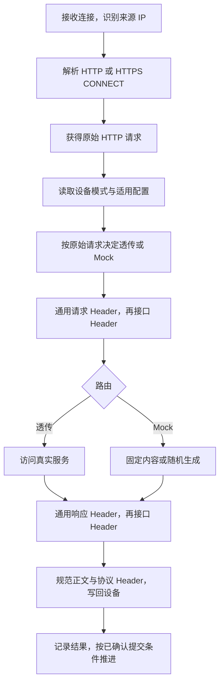

# 03 代理、设备与 HTTPS

状态：处理链路实现建议；已确认首版仅覆盖自研 Android/iOS App、H5 的 HTTP/HTTPS JSON。

## 1. 接入与身份

所有手机配置电脑局域网地址及同一个代理端口。DeviceKey 来自接入套接字的远端 IP，去除临时源端口并规范化 IPv4/IPv6 表示；不读取客户端可伪造的 X-Forwarded-For 来改变设备身份。

IP 是本次网络来源标识，不是硬件永久 ID。NAT 下若两台设备呈现同一来源 IP，无法按现有规则分离；IP 改变视为新设备，默认真实转发并应用通用 Header。界面显示 IP、用户备注、最近活动、模式和组，不自动合并。

建议手机代理监听与管理监听分离：前者绑定所选局域网网卡；后者仅本机回环。端口值、监听启动方式与保留选择由 D07 确认。

## 2. 请求处理顺序

HTTPS 未解密隧道不能进入图中原始 HTTP 请求阶段，也无法修改其中 Header/JSON。需在流量视图明确显示“仅隧道转发”，不能显示已应用 Mock。

请求快照至少保留匹配所需的原始方法、authority、路径、Query、多值 Header、可用 JSON 视图。捕获是否持久保存与创建短期匹配视图无关。

## 3. HTTPS 与证书

本机建立 CA；仅为需要解密的目标域名签发叶子证书并缓存。CA 私钥留在本机，由平台受限存储/文件权限保护，不经 MCP、导出业务记录或团队共享发送。设备接入界面提供根证书安装入口及平台指引。

iOS 信任、Android 自研调试包的用户 CA 信任、证书固定均影响连接；采用测试构建可配置的信任策略验证。不能把代理证书配置视为适配所有网络栈的充分条件。证书安装、HTTPS 访问、页面业务完成需要分别验收。

上游 TLS 必须独立验证，不能因为本机解密就默认忽略真实服务证书错误。仅隧道转发/解密域名范围与异常提示需在接入原型中评审。

依据见 [桌面及代理调研](../research/desktop-stack.md) 中 Charles、Android、Apple 和代理库官方资料。

## 4. HTTP 细节与内核验证

| 事项 | 设计要求 |
| --- | --- |
| CONNECT | 提取目标地址，校验代理目的地，HTTP JSON 处理发生在 TLS 解密之后 |
| 长连接与并发 | 每请求携带来源 IP；不能按一条连接只匹配一次组步骤 |
| HTTP/2 | 验证设备到代理和代理到上游的协商；是否降级及兼容性以实测为准 |
| HTTP/3/QUIC | 首版不承诺拦截绕过系统 HTTP 代理的 UDP 流量；自研测试端需确认实际走代理 |
| 压缩 | 匹配/展示时需要正确解码；转发或生成后保持正文与编码一致 |
| 多值 Header | 保留 Set-Cookie 等独立项，不能通用逗号拼接 |
| 消息长度 | 正文改变后重算或交传输库管理 Content-Length；避免旧 Transfer-Encoding 残留 |
| 无正文响应 | HEAD、204、304 等响应遵守协议正文规则 |
| 不支持正文 | 界面标注无法解析，Header 处理能力与 JSON 条件能力分开呈现 |

goproxy 是候选而非已验证的最终依赖。必须先完成真实手机 HTTPS、HTTP 协商、压缩、取消、Header 修改的验证，再固定发布版本。替换代理库不应改写匹配器与生成器。

## 5. 故障与可观察性

区分接入连接失败、手机不信任证书、上游连接失败、上游真实错误响应、生成失败、设备断开。上游本身返回 4xx/5xx 属于收到真实响应；不要统一包装成“Mock 错误”。

生成失败明确返回工具错误且不访问真实服务。未命中真实服务的耗时和错误照常记录，不能误报为 Mock 组失败推进。

展示摘要建议含设备、方法/URL、开始时间、耗时、状态、响应来源、未命中原因、使用版本。正文按需加载；具体保留策略待 D09。完整网络发送失败不能被“已生成响应”覆盖。

## 6. 验收入口

至少两台不同来源 IP 设备接入同一端口，分别运行不同组；一个设备切模式不影响另一个。对同一接口验证原始 Header 匹配与重写后实际转发值不同；证书不信任时显示可定位原因；关闭应用后停止监听。
