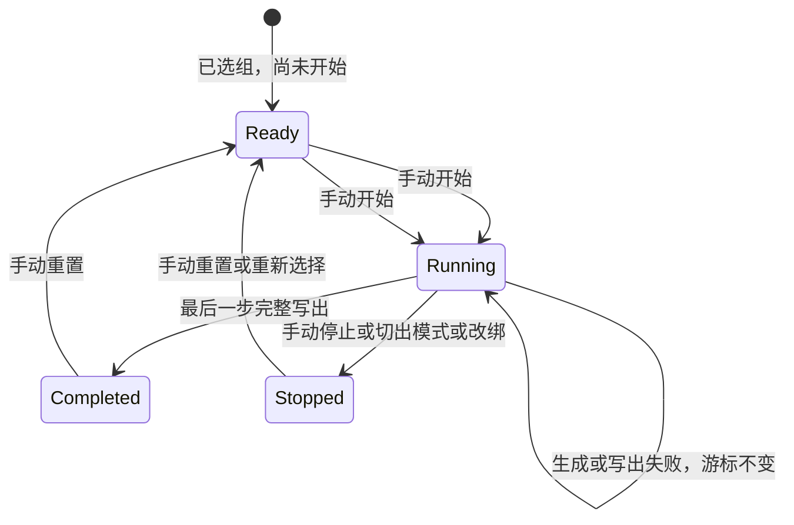

<!-- 产品归属：2026-09-10 起本专题由规则集管理承接，设备运行独立；旧 Mock 组不再作为一级导航。范围见 D17。 -->
# 07 Mock 组运行与并发

已确认：每 IP 独立运行，只匹配当前步骤；完整响应成功写入连接后才推进，生成/写入失败均不推进；完成后真实转发。D05 已确认切模式/改绑/重置允许旧请求完成但不推进新运行；同一步并发等待仍待 D04。

## 1. 三类对象

Group 是可编辑组身份；GroupRevision 是一次顺序与步骤开关快照；Run 是某 IP 对此快照的一次执行。一个组被多设备选择，不共享游标。

开始时读取组当前版本，过滤禁用步骤得到 effectiveSteps。每步引用稳定 mockId；命中时读取该 Mock 当前响应版本。运行保存 stepId 与有效位置，不能用不断变化的编辑列表下标推断当前步。

独立规则 standalone_enabled 不参与 effectiveSteps；关闭抓包不影响任何状态转移。

## 2. 状态机

重置与开始建议作为两项明确操作：重置选取最新组版本，开始进入 running；若界面提供“重置并开始”，须清楚表达组合动作并确认交互。已确认的是必须人工触发，不能自动循环。空有效步骤的开始行为待 D16。

所有非 running 状态走真实服务并应用通用 Header。实际运行记录中的 completed/stopped 是历史结果，重新开始创建新 runId；不得把历史状态改回 running 隐藏上一轮记录。

## 3. 正常请求流程

1. 读取设备绑定与运行代次。
2. 仅用原始请求判断当前步骤。
3. 未命中立即形成真实转发计划，不占用运行状态锁等待上游。
4. 命中时预占当前步骤，读取响应版本；后续生成使用此版本。
5. 生成响应并应用响应 Header；失败生成明确错误响应，释放预占，不推进。
6. 完整写入连接，包括传输库能报告的结束/flush 错误。
7. 写出失败释放预占，记录失败，不推进。
8. 写出成功且 runId/generation/stepId 仍与预占一致，提交一次成功执行并推进一个有效步骤。
9. 最后一步提交后标记 completed；后续请求真实转发。

第 6 步成功仅表示工具能确认的本地连接写出成功，无法证明手机处理成功。用户在业务层主动重试的旧接口若已不匹配新当前步，按已确认规则访问真实服务。

## 4. 并发预占建议（D04 待确认）

不能让两个并发请求分别读取同一游标后都生成该步响应。建议在短锁内记录 reservationId；锁外生成/写出；再短锁提交。

同一步被预占时，另一个候选请求建议等待并在释放后重新判断：前一个成功则按下一步判断；前一个失败则仍可命中原步骤。等待队列需有界，超时处理尚未确认。对于确定不匹配当前步的其他请求直接透传，不因预占等待真实网络请求。

不采用“预占后立刻把游标向前移再失败回滚”，否则后续步骤可能已经执行，无法可靠回滚。

## 5. 重置与模式切换

已确认切出组模式或改绑另一个组停止旧运行；新组或切回需要手动开始。运行代次每次替换都改变，所有迟到回调校验代次，旧响应即使写出也不得推进新运行。

D05 已确认允许旧请求按已选定计划完成，普通请求超时仍适用，不因重置或改绑主动断开。CompletionResult 建议包含 obsolete_generation；记录“旧运行响应已写出但不推进新运行”，区别于正常成功步骤。该确认不包含退出应用的无限排空；退出仍停止代理，排空时限单独明确。

切到相同组的重复提交是否作为幂等无变化建议在接口层按当前绑定版本判断，不把界面重复提交误当成另一次重置。

## 6. 编辑与运行

| 编辑 | 正在处理的请求 | 下一请求/下一运行 |
| --- | --- | --- |
| 响应正文、随机规则保存 | 保留已选版本 | 下一请求使用新版本，游标不重置 |
| 组步骤顺序、步骤启用 | 继续原快照 | 下次开始/重置采用新组快照 |
| 独立规则启用 | 不影响组当前快照 | 仅影响独立模式 |
| Header / 普通规则匹配 | 保留已选版本 | D06 已确认下一请求生效 |
| 顺序匹配条件 | 保留当前快照 | D06 已确认下次开始/重置采用 |
| 删除引用 Mock | 策略待 D10 | 不能隐式停止运行或跳步 |

## 7. 失败与恢复验收

两 IP 共用同组仍独立；前置/后置接口真实转发；完整写出成功恰好推进一次；断开连接不推进；生成失败后保存修复即可重试；重置时旧请求回调不能推进新运行；关闭应用后重启不自动续跑。崩溃发生在网络写出与状态持久化之间的差异要有 interrupted 记录，不能宣称跨崩溃只执行一次。
